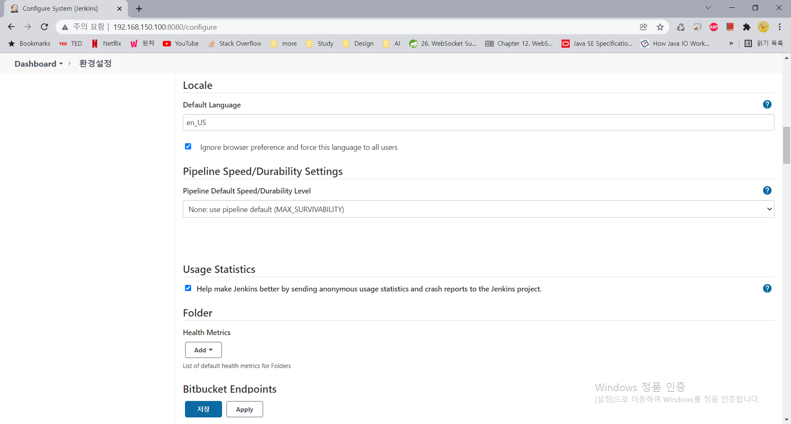
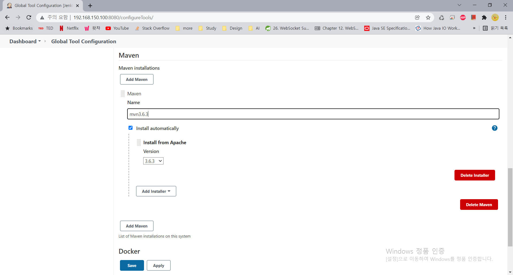
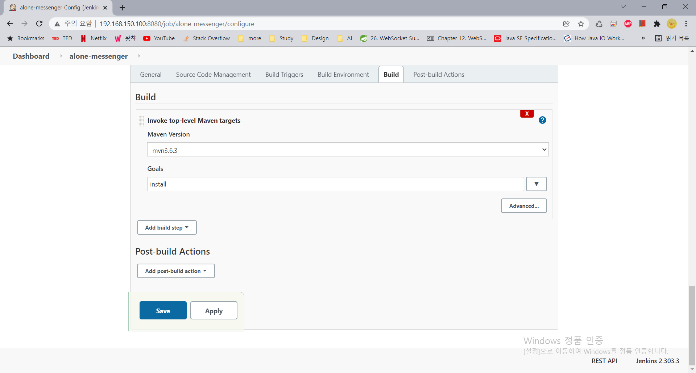
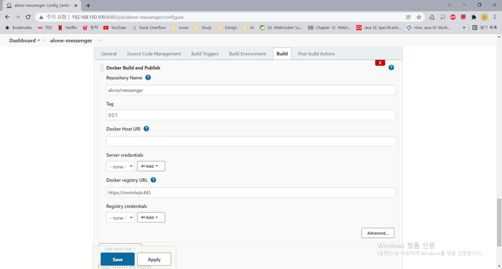

# alone-ci-cd
여행 커뮤니케이션 "혼자왔니" 프로젝트 CI/CD 구성 

## What you will get
- Docker in Docker
- (블루오션 플러그인 내장) Jenkins
- Docker 로컬 레지스트리
- Docker 로컬 레지스트리 static UI

## Prerequisites
- Git (tested in 1.8.3.1)
- Docker (tested in 20.10.10)
- Docker-compose (tested in 1.29.2)

## Installation
```bash
$ git clone https://github.com/inminhouse/alone-ci-cd.git
$ cd alone-ci-cd
$ sudo docker-compose up -d --build
```

## Jenkins
- Installation
    - 브라우저에서 http://IP:8080으로 이동
    - 아래 명령어를 이용하여 어드민 패스워드 조회 후 Unlock Jenkins 페이지에 입력
    ```bash
    $ sudo docker exec jenkins cat /var/jenkins_home/secrets/initialAdminPassword 
    ```
    - Suggested plugins로 설치 진행
    - 관리자 계정 생성, 도메인 설정 후 설치 완료
- Locale Configuration
    (*) 한국어 번역에 제대로 되어 있지 않아 영어로 사용할 것을 추천
    - Jenkins 관리 > Plugins 관리 > 설치 가능 탭으로 이동
    - 검색바에 'Locale' 입력
    - Locale 플러그인을 선택하고 하단의 [install without restart]를 클릭하여 설치
    - Manage Jenkins > Configure System > Locale 섹션으로 이동
    - [Default Language] 입력 창에 'en_US' 입력
    - [Ignore browser preference and force this language to all users] 체크 박스 선택
       
    - 저장
- Maven Configuration
    - Manage Jenkins > Global Tool Configuration > Maven 섹션으로 이동
    - [Add Maven] 클릭
    - 이름을 지정하고 사용할 Maven 버전 선택
       
    - 저장
    - Dashboard > 생성한 프로젝트 > Configure (왼쪽 메뉴바) > Build 탭으로 이동
    - [Add build step] 클릭
    - [Invoke top-level Maven targets] 선택 후 위에서 설정한 Maven 선택
    - [goal] 입력 창에 'install' 입력
       
    - 저장
- Docker Configuration
    - Manage Jenkins > Manage Plugins > Available 탭으로 이동
    - 검색바에 'Docker' 입력
    - Docker와 CloudBees Docker Build and Publish 플러그인을 선택하고 하단의 [install without restart]를 클릭하여 설치
    - Dashboard > 생성한 프로젝트 > Configure (왼쪽 메뉴바) > Build 탭으로 이동
    - [Add build step] 클릭
    - [Docker Build and Publish] 선택 후 필수 입력 창에 값 입력
       
    - 저장
 - Create Project
    - Dashboard의 [New Item] 클릭 
    - 프로젝트 명 입력 후 [Freestyle project] 선택
    - Git, Maven, Docker 설정 후 저장
    
## References
- https://www.jenkins.io/doc/book/installing/docker/
- https://docs.docker.com/registry/deploying/
- https://pkuwwt.github.io/techniques/2020-04-04-setup-a-private-docker-registry/
